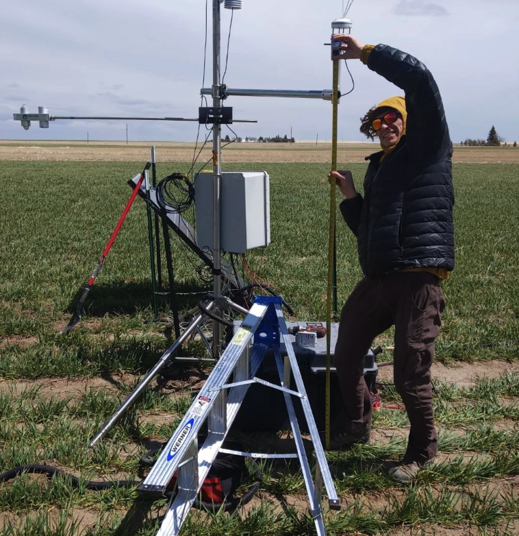

In spring 2022, Alex set up two eddy covariance towers at the Hellbaum farm to monitor the carbon and water cycles of different fields. As you can see, the wyoming wind can make this work a little difficult...

 

What is eddy covariance? Here’s Alex describing how Eddy Covariance systems can measure carbon sequestration in ecosystems!** This setup is monitoring the effects of pine beetles and fire in the Snowy Range, but the same system will measure carbon and water cycling in Kernza.



Some notes: this doesn’t actually measure the total water budget if an ecosystem, just the gaseous component. Also, the net carbon assimilated by an ecosystem in a given year isn’t necessarily permanently sequestered.