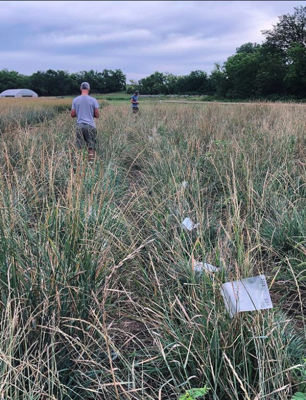

Hannah went to The Land Institute to sample rhizosphere soil from different breeding 
lines of Kernza (and un-bred intermediate wheatgrass). As we breed for plants that 
put more resources into grain, they may put fewer resources into roots, and to feed 
all the microbes that live in and on those roots. Or maybe not? We’ll see! Also got 
to hang out with the great crew at TLI plus this silly dog and catch some fish

              |   
:-------------------------:|:-------------------------:
  |  