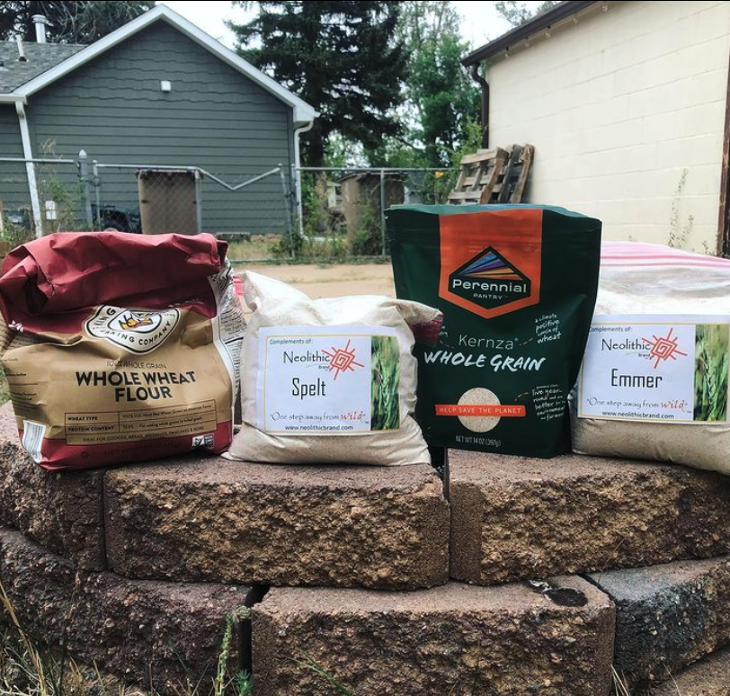

We did a alternative-grains-pancake taste test! Kernza got first, then emmer, spelt, and lastly whole wheat- though we might be biased 🤷‍♀️ Thanks to First Grains (another Western SARE-funded research project) for the Wyoming-grown emmer and spelt, and Perennial Pantry for the recipe

