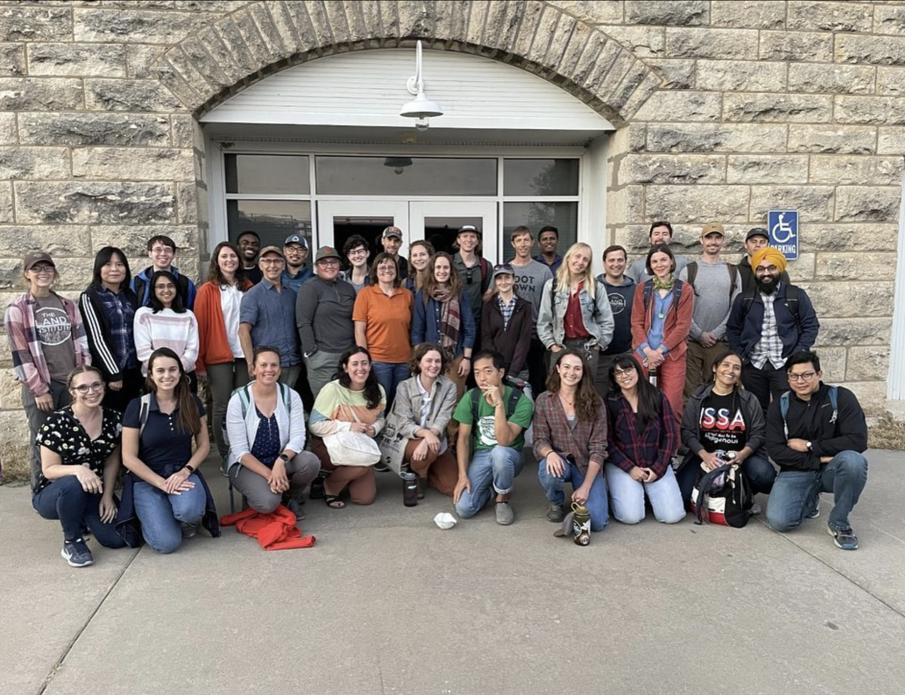

We went to Kansas for the Land Institute’s early career workshop! 
We got to tour the Kanza Prairie and learn how disturbance (bison, fire) 
affects plant communities and meet to many people studying so many aspects of perennials- water and nutrients use, climate impacts, 
genetics, soil organic matter formation, supply chains, intercropping, disease resistance… 🌾🥳

Hannah and I both gave short talks at the conference -- check them out here

