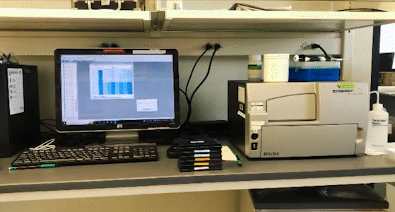
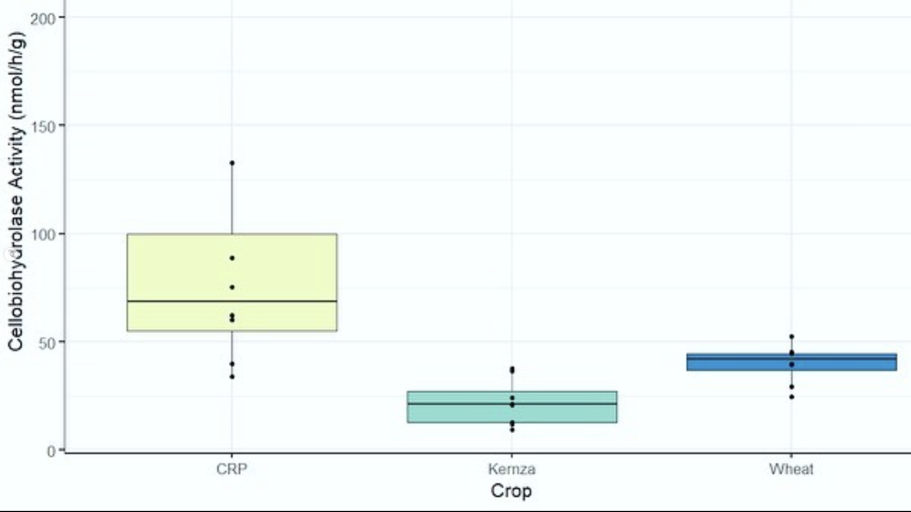

I used this machine 💻 to measure enzymes 🦠 in the soil 🪴 I collected last summer🌞! 
We mix soil with special substances that fluoresce when they are broken down by enzymes in the soil, 
then measure that fluorescence using this machine. Swipe to see how one enzyme was different between wheat, Kernza, 
and CRP (perennial grassland) fields.

              |   
:-------------------------:|:-------------------------:
  |  