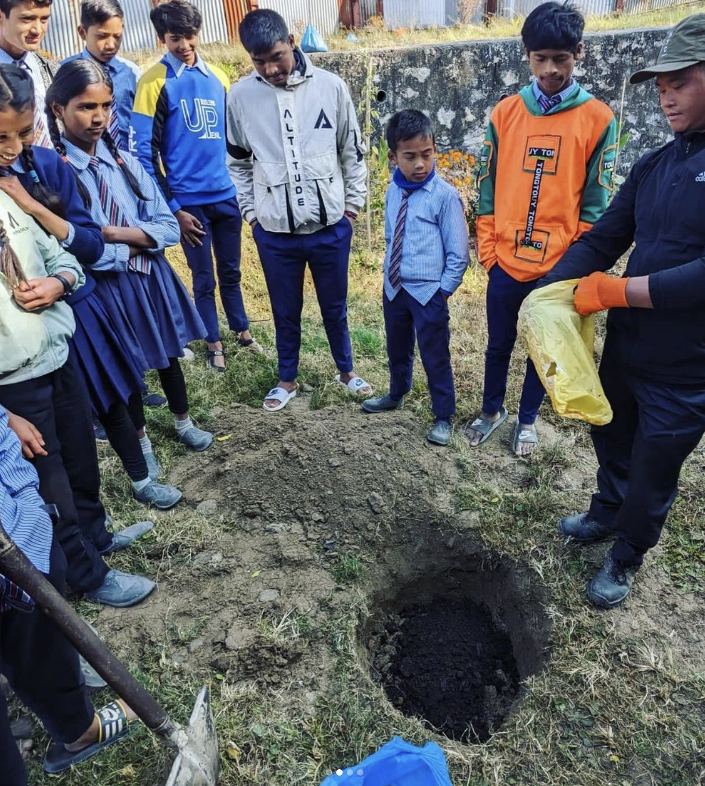
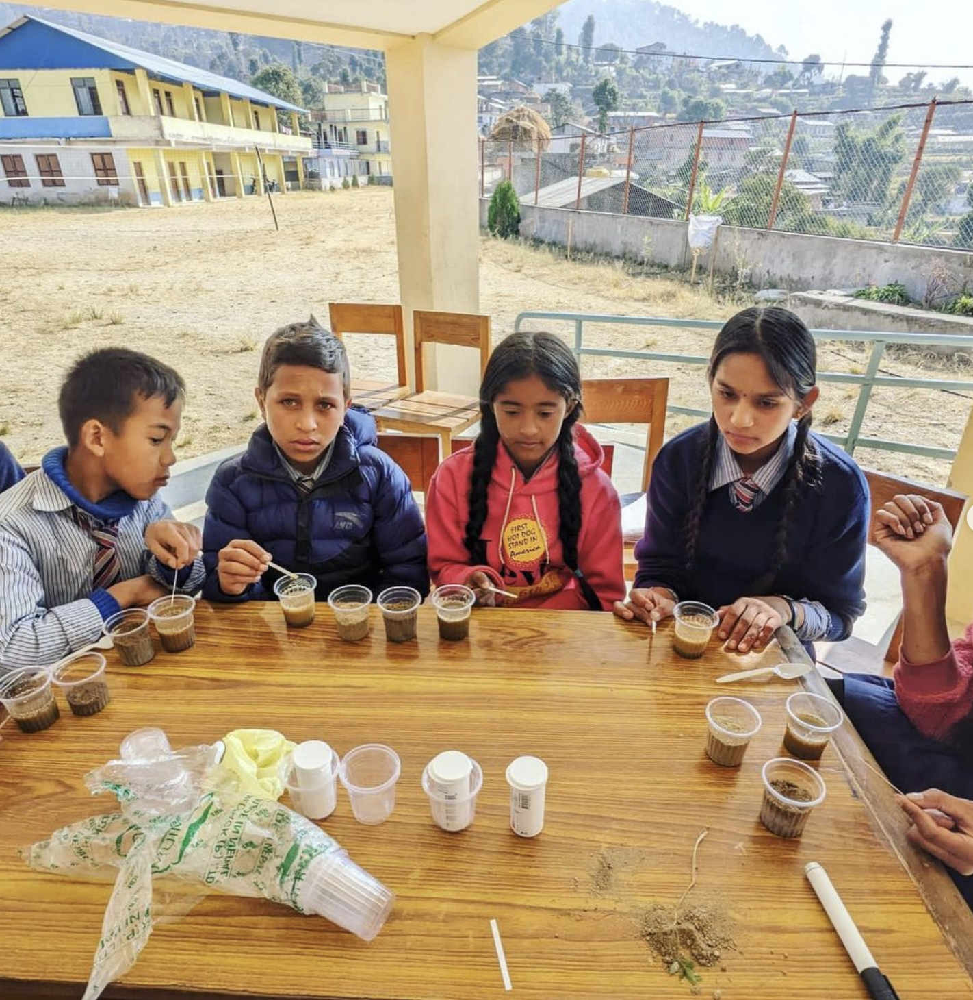
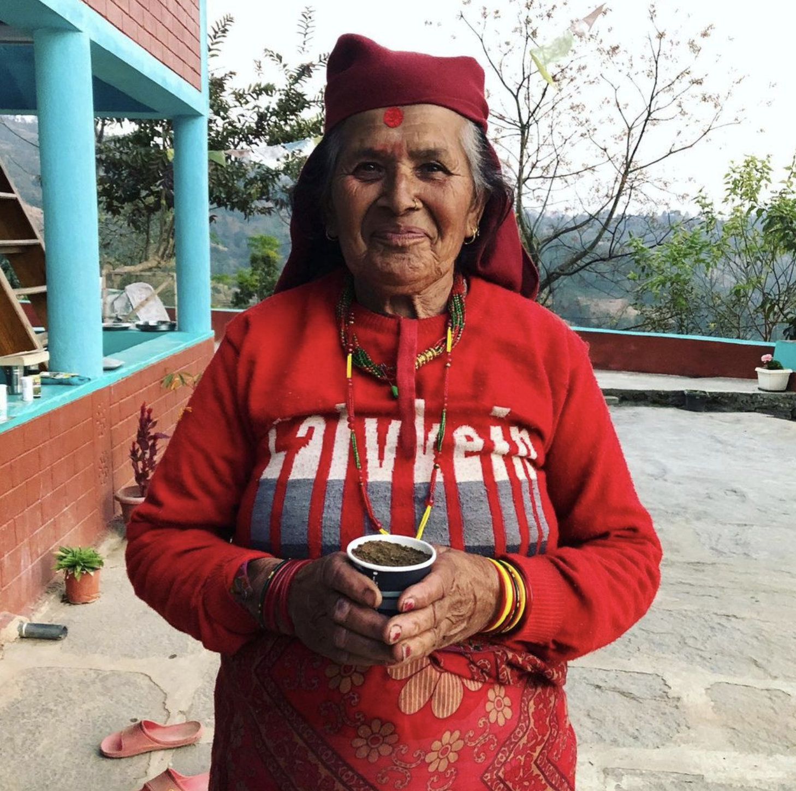

Over winter break I got to help teach a soil science workshop in Nepal through funding from the UW Center for Global Studies and with [Biloba Organic](https://bilobaorganic.org/)! It was a blast, I’m constantly impressed by Nepali students’ enthusiasm and knowledge about all things ag. The project is establishing a teaching orchard at a local school, and the first trees (🍑and🍎) were planted this winter! (look to the bottom right to see my favorite soil workshop participant , aamaa)

              |   |   
:-------------------------:|:-------------------------:|:-------------------------:
  |  |  