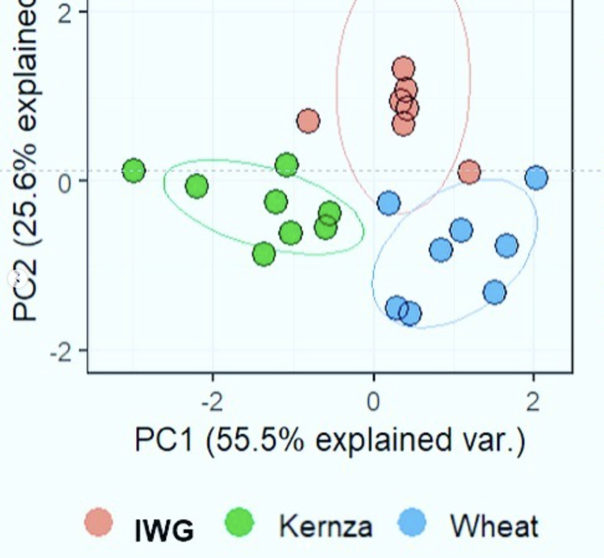

We’re analyzing phospholipid fatty acids in soils! Different microbial groups have differently structured fatty acids in their cell membranes, which can show us how microbial communities differ between soils. For example, fungi are particularly sensitive to disturbance, so avoiding things like tillage can help increase fungi in the soil, which in turn helps stabilize soils and protect organic matter 🦠 🧫 🥼. Apologies for the poorly cropped graph!

