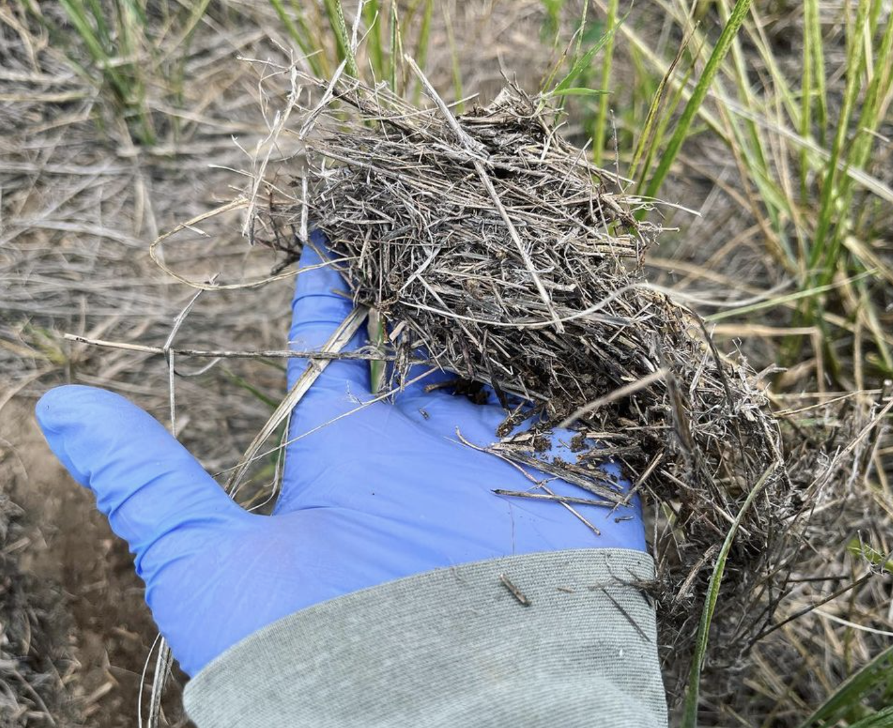
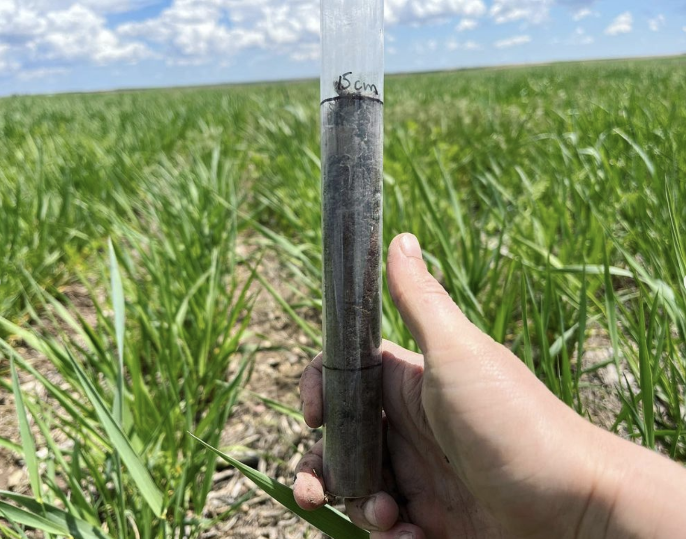

First soil sampling of the season! The Kernza is looking green and happy, 🤞 that it keeps raining. We’re measuring soil density this week: lighter soil has more pores, which are habitat for soil life (🐛 🪱 🦠 🍄) and store water in the soil. Perennial roots (and the soil life they support) help build soil structure and soil pores over time, making the soil more like a sponge 🧽 and less like a brick 🧱

              |   
:-------------------------:|:-------------------------:
  |  