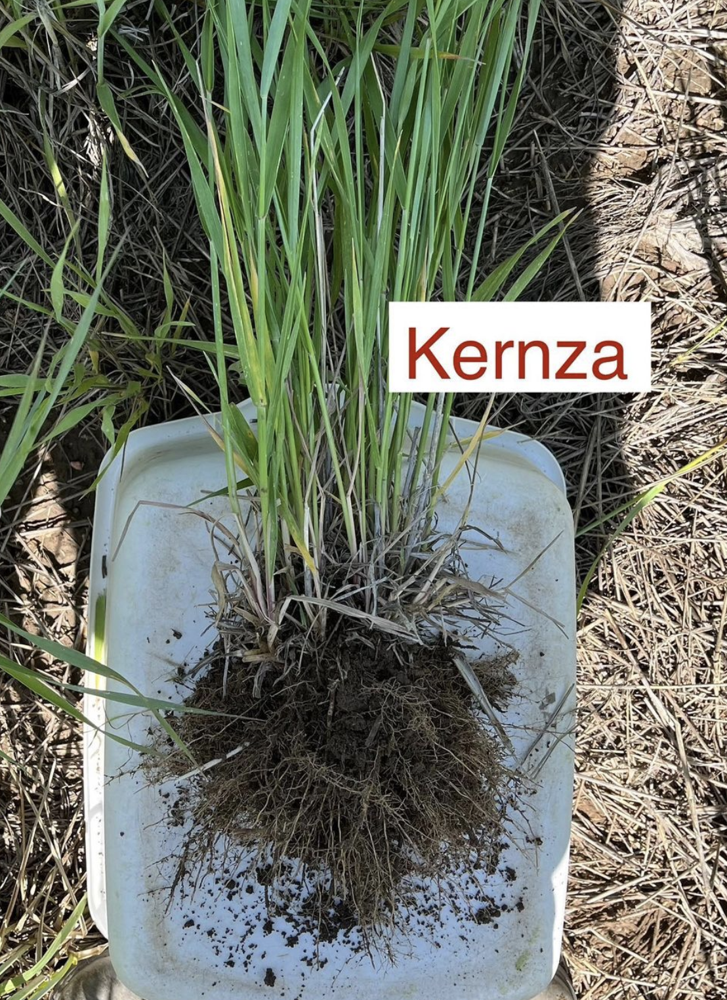
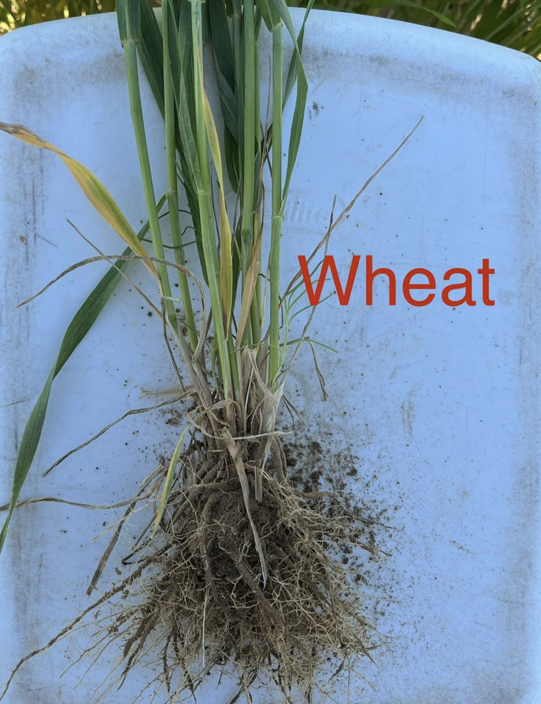

We're measuring wheat and Kernza root areas this summer -- this will help us understand how and where these crops get their water from.

Also, here are some roots from our rhizosphere soil sampling! 🪴 Now that the Kernza is two years old, its roots are densely branched and looking much more similar to wild-type intermediate wheatgrass than to wheat, which shows how much perennial-ity matters for root development 🌾

              |   |   
:-------------------------:|:-------------------------:|:-------------------------:
  |  |  