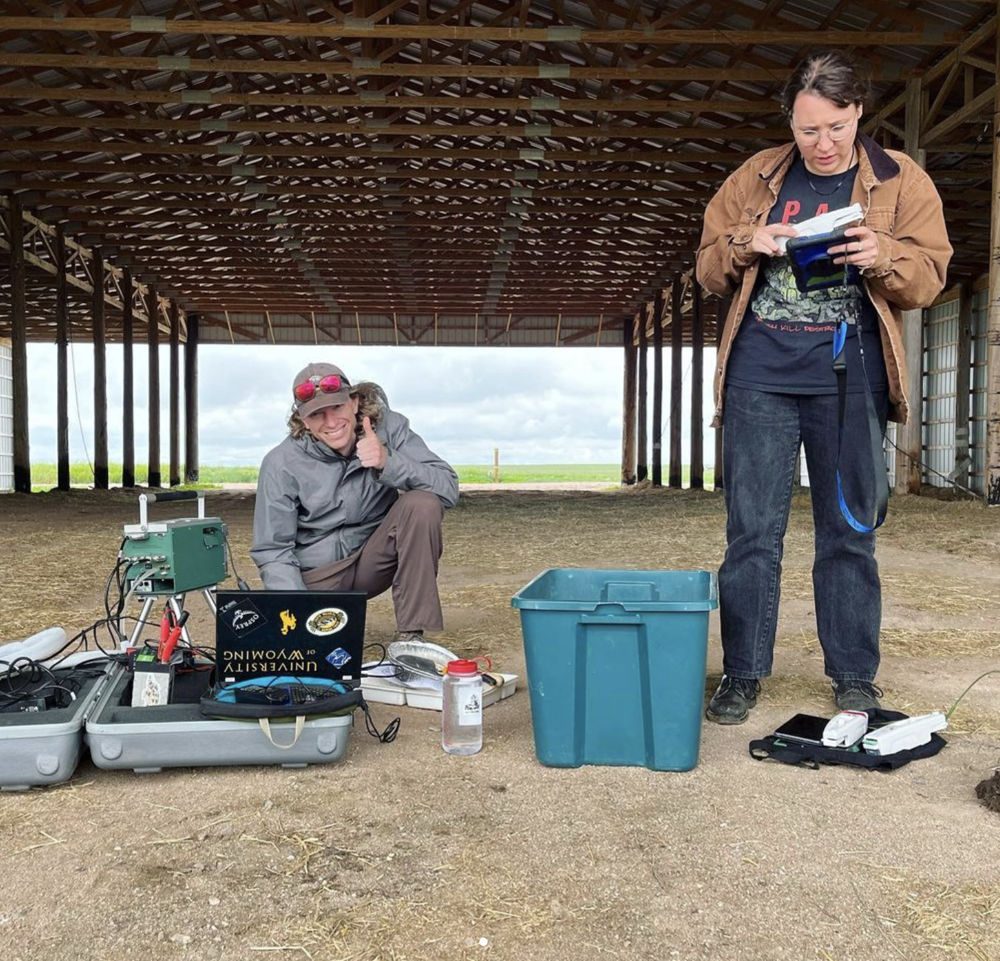

Great turnout for our Kernza Wyoming Farm Tour - We were joined by folks from the 
University of Wyoming, The Land Institute, 
USDA, [Mad Ag](https://madagriculture.org/), NRCS, and [Odell Brewing Co](https://www.odellbrewing.com/)! Thanks to everyone who helped lead soil health and plant physiology research demos, and especially to Monte Lerwick at [Homestead Acres Ag](https://www.homesteadacresag.com/) for sharing with us his Kernza fields and his extensive wisdom of growing perennials on the windy high plains.

