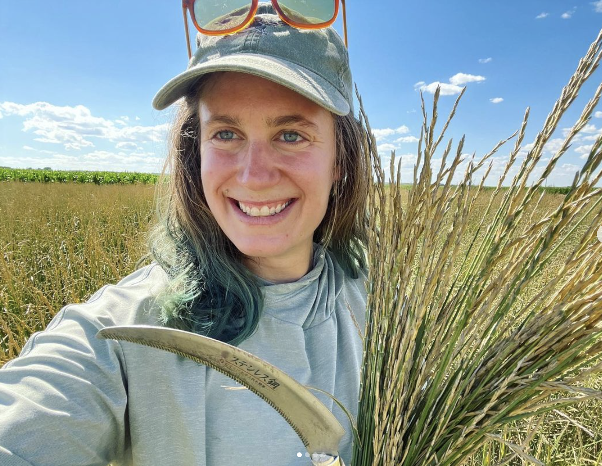
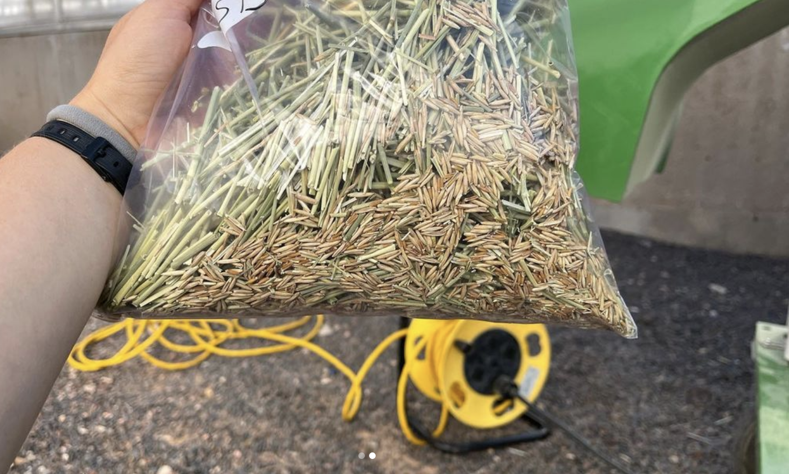

Wyoming Kernza harvest, and showing some Kernza at the University of Wyoming research station field day!
We harvest and thresh our small plots by hand so we can get better estimates of biomass and yield across a whole field

              |   
:-------------------------:|:-------------------------:
  |  