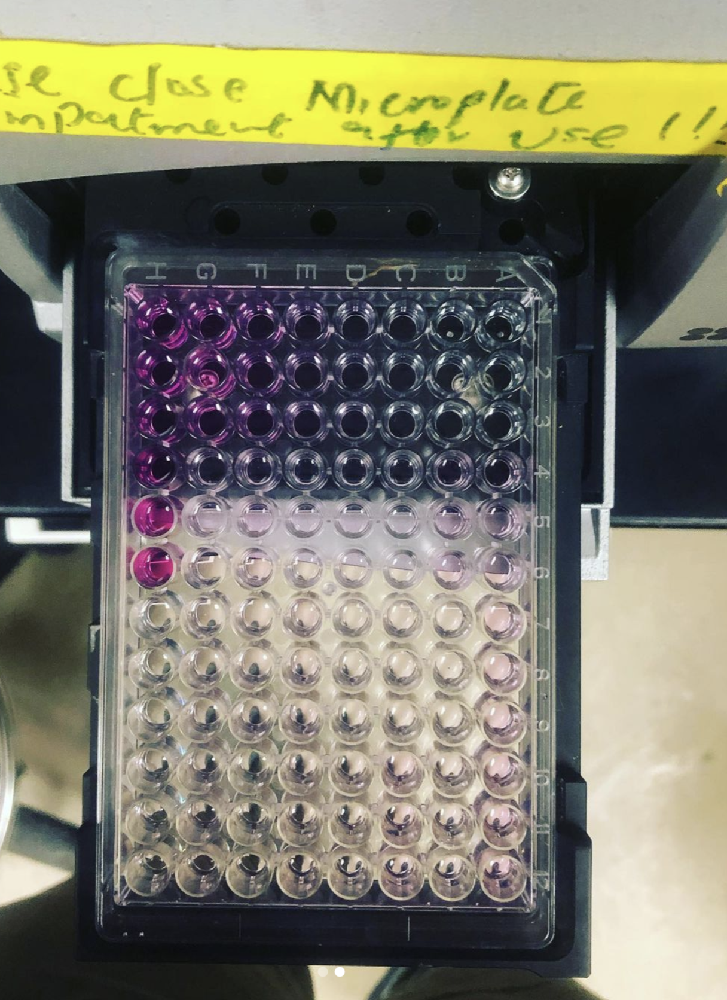

Nitrate analysis, Step 1: Shake soil samples with some salty water to extract nutrients that are bound to soil particles. Step 2: In the tiny wells of this plate, add that salty water + chemicals that turn purple when they react with nitrate. Step 3: “Read” the exact color of each well using a special computer. We included standard solutions that have specific amounts of nitrate, and by comparing our samples to those standards, the computer can convert “purpley-ness” into grams of nitrate in the soil.

