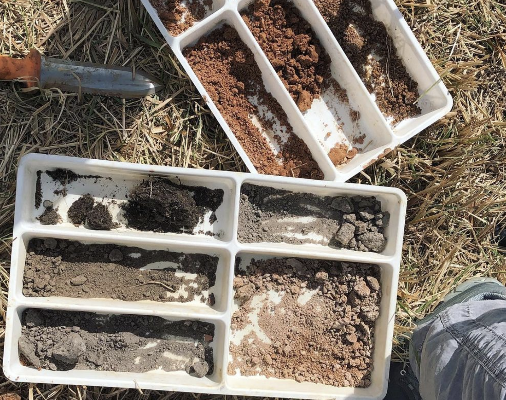
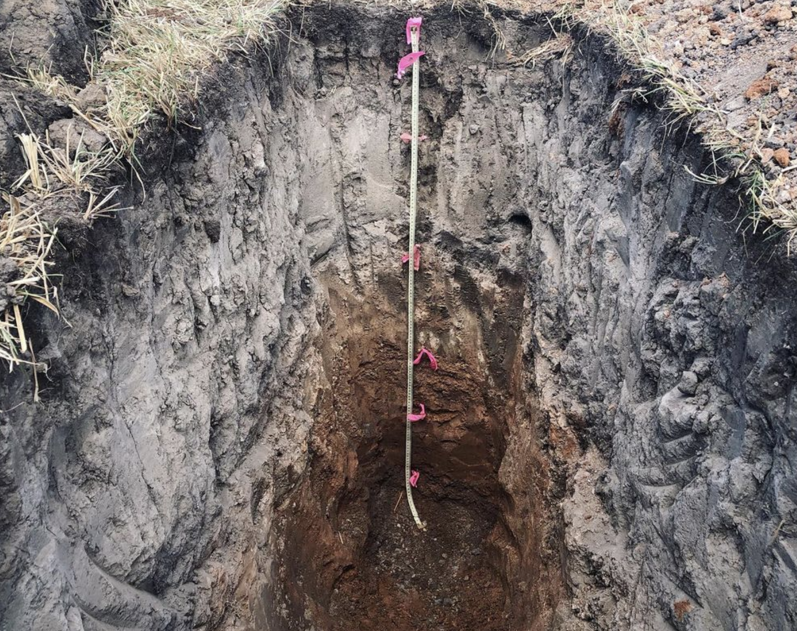

Soil color can tell us a lot about what going on down there 
(black for organic matter, red & yellow for iron, white for 
calcium carbonate…) We dug pits for a research project looking 
at high-elevation hay meadows and thought about how deep-rooted 
perennial grasses (like Kernza 🌾!) can energize soil formation 
and organic matter storage in these prairie soils

 
 
              |   
:-------------------------:|:-------------------------:
  |  