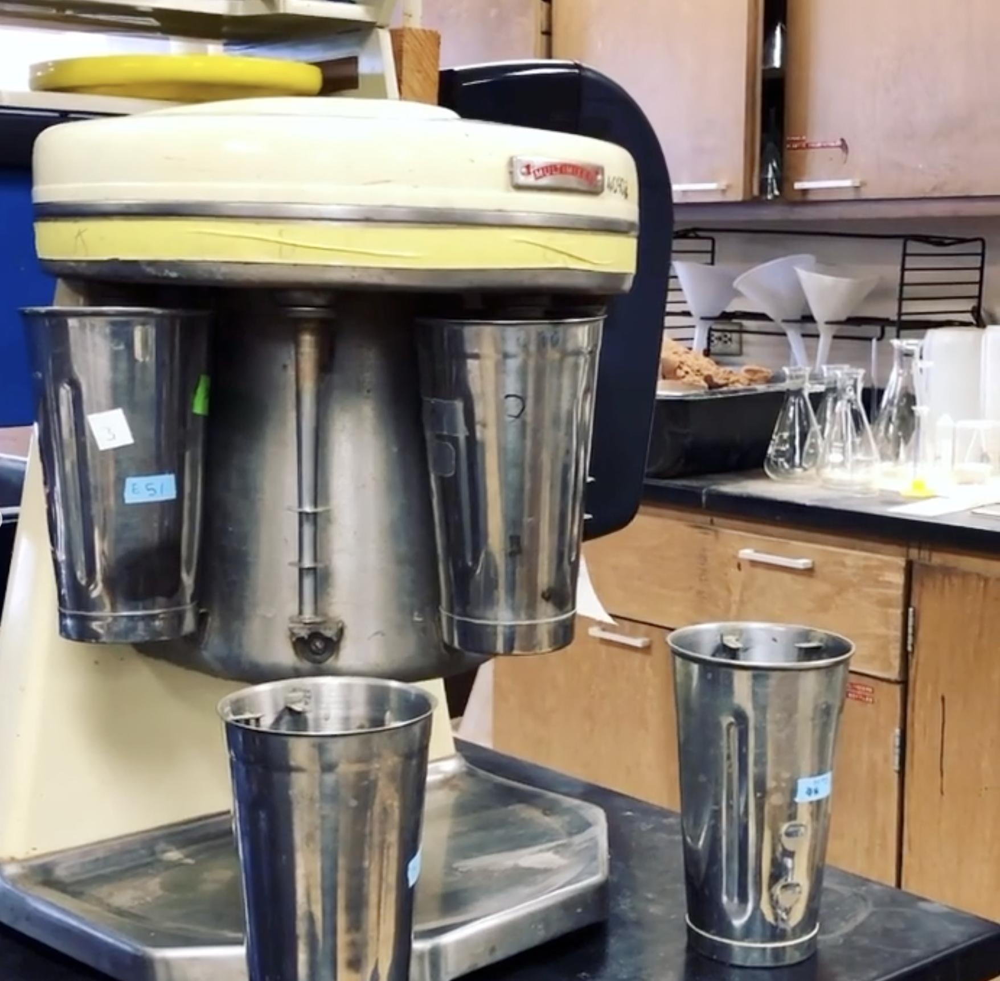

One dirt milkshake please, hold the milk

We analyze soil texture by measuring the density of a soil 
slurry over 24 hours- larger particles (sand and silt) will 
slowly settle to the bottom of the cylinder, while small 
particles (clay) will stay suspended. Soil texture is a big 
driver of microbial activity, so if we want to understand how 
soil microbes indicate changing soil health, we also need to 
know the soil’s texture!

