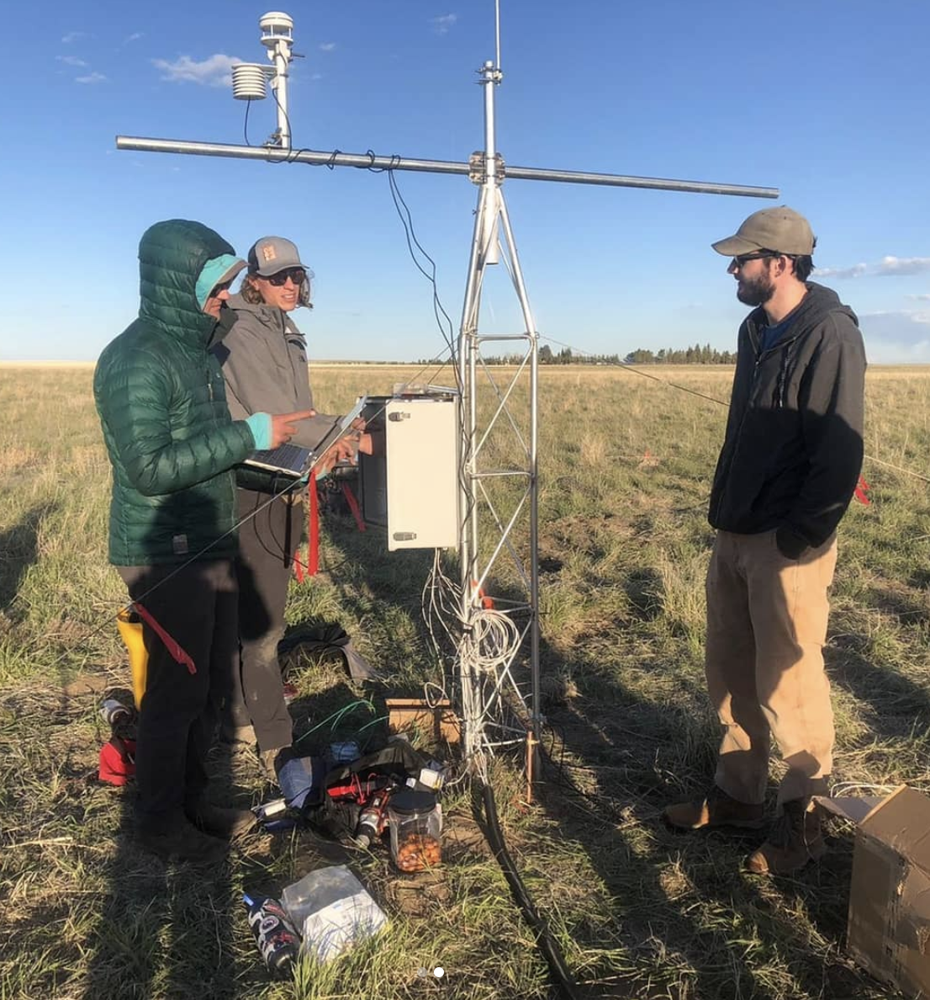

Setting up the first of the meteorological towers! This one will measure an entire suite of environmental drivers to help us compute carbon and water cycling

 
 
              |   
:-------------------------:|:-------------------------:
  |  